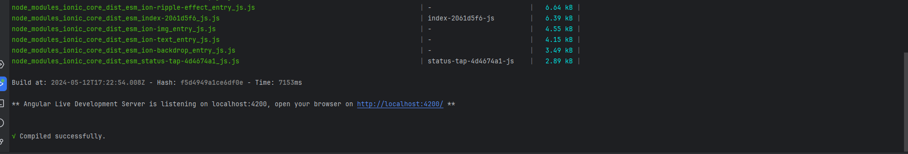

# setup-guide
# Liên hệ : 
- Nếu có vấn đề gì trong quá trình cài đặt hoặc chạy project thì liên hệ qua telegram trong giờ hành chính (8h - 17h) - Sau giờ hành chính có thể liên hệ qua facebook
- Telegram : https://t.me/thanhdevwork
- Facebook : https://www.facebook.com/thanhdang1410

# Hướng dẫn setup chạy code project
## Lưu ý quan trọng
- **Trong project BE đang có lưu thông tin của database chỉ nên share config nội bộ tránh share thông tin kết nối đến những người khác**
- Nên sử dụng hệ điều hành window để chạy poject. Nếu sử dụng MacOS thì cài giả lập Window.
- Nên sử dụng IDE của Jetbrain để chạy code, tránh việc mất thời gian setup môi trường  
- IDE của jetbrain có cấp tài khoản free cho cái mail có đuôi edu  
- Webstorm để chạy project FE (Angular 12) + IntelliJ IDEA để chạy project BE (Spring boot 2.x.x + Java 8, Java 1.8)  
- Nếu gặp khó trong việc đăng ký tài khoản edu Jetbrain thì sẽ sử dụng bản active để sử dụng trong quá trình học (CHỈ SỬ DỤNG CHO MỤC ĐÍCH EDUCATION KHÔNG ĐƯỢC SỬ DỤNG ĐỂ PHÁT TRIỂN CÁC PROJECT ENTERPRISE)  

## Hướng dẫn mở và chạy project BE Java 
1. Mở source code bằng Intellij IDEA (Lưu ý mở folder cuối cùng chứa code của project)

> Vd: Ở đây đường dẫn D:\Coding\diamond-shop-be chứa code của project BE

2. Sử dụng tổ hợp phím `Ctrl + Shift + O` để mở project

 

3. Sau khi mở poject thành công, sử dụng tổ hợp phím `Ctrl + Alt + Shift + S` để setup môi trường cho project

4. Chọn mục `Project` và chọn `Project SDK` là `1.8` (Java 8). Nếu chưa có SDK thì tiến hành tải SDK về (Vendor lựa chọn tùy ý)

5. Sau khi setup thành công thì chọn `Apply` và `OK` để hoàn tất quá trình setup

6. Tiến hành chạy project bằng cách sử dụng tổ hợp phím `Shift + F10` hoặc chọn `Run` để chạy project

Khởi động thành công project BE Java sẽ hiển thị dòng log ` Tomcat started on port(s): 8091 (http) with context path ''`

## Hướng dẫn mở và chạy project FE Angular
1. Tải và cài đặt node JS version 16.x.x (bấm next liên tục không cần để ý các config khác) ở link sau : https://nodejs.org/dist/v16.16.0/node-v16.16.0-x64.msi

2. Sau khi cài đặt xong. Mở source code bằng Webstorm mở như project BE java

3. Mở terminal trong Webstorm và chạy lệnh `npm install` để cài đặt các package cần thiết cho project

4. Sau khi cài đặt xong chạy lệnh `ng serve` ở terminal hoặc bấm nút `Run` để chạy project

Khởi động thành công project FE Angular sẽ hiển thị dòng log `Angular Live Development Server is listening on localhost:4200, open your browser on http://localhost:4200/` .Mở trình duyệt và truy cập vào đường dẫn `http://localhost:4200` để xem project chạy thành công

## Hướng dẫn active bản quyền Jetbrain
### Lưu ý:
- **CHỈ SỬ DỤNG CHO MỤC ĐÍCH EDUCATION KHÔNG ĐƯỢC SỬ DỤNG ĐỂ PHÁT TRIỂN CÁC PROJECT ENTERPRISE**
- **Không được xóa folder cài đặt đi sau khi active thành công**

1. Giải nén file `jetbra.rar` trong thư mục active-webstorm

2. Cài đặt JDK 17 trên trang chủ của Oracle :https://download.oracle.com/java/17/archive/jdk-17.0.10_windows-x64_bin.msi

3. Chạy file `install-all-users` và đợi 1 lúc nếu hiện thỉ done là cài đặt thành công

4. Mở đường dẫn trong file `readme.txt` lựa chọn 1 host đang hoạt động để lấy active code

5. Vào `Help` -> `Register` -> `Active code` -> `Paste active code` vào ô `Activation code` và chọn `Activate`

6. Thành công sẽ hiện tương tự như sau như sau : 
